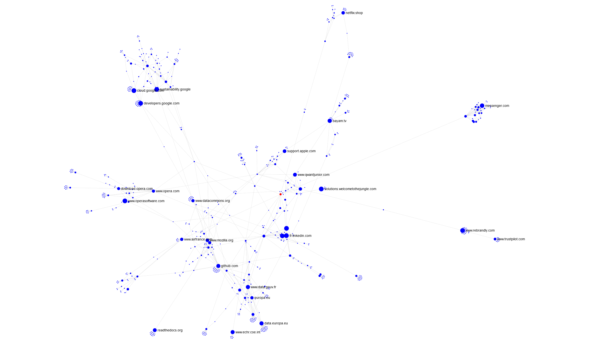
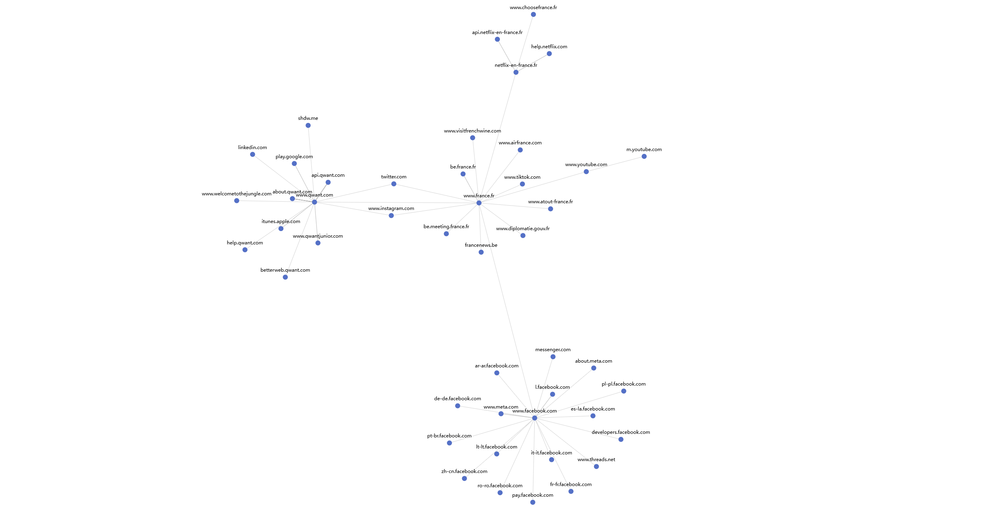
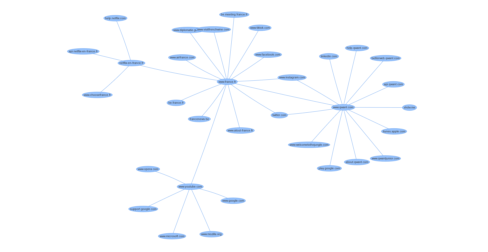
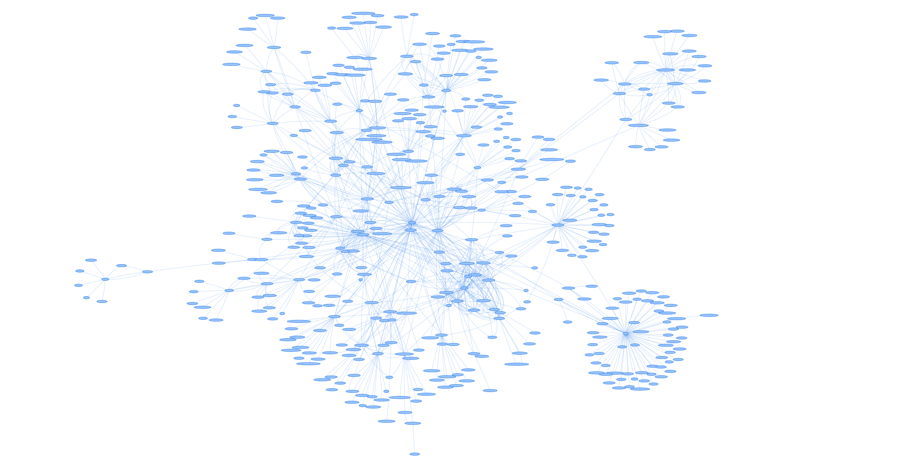
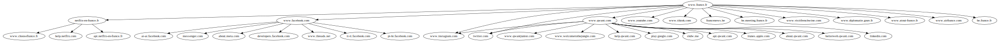

# Nomad

A work-in-progress experimental web crawler that attempts to map the connections between domains.

## Design

Most crawlers are created to search the depth of websites to find everything indexable, Nomad is specifically optimised for breadth, only requesting the root page (`/`) for each domain that it finds.

**WARNING:** *I have made some basic attempts to prevent spamming websites as well as to avoid spam filters, but there is potential that websites could flag your connection and block you (probably ip ban) for using this.*

## Modes

### Web Server

- See [graphology-frontend's readme](./graphology-frontend/)
- Runs a web server, serving a React frontend & WebSocket based API
- Configured, started, and stopped via API
- Feeds data back over the WebSocket to display crawl data in real time
- [Demo video](https://www.youtube.com/watch?v=-Yii_hK8Jyg)

### CLI

- See "CLI Usage" below
- Configured and started via the command line
- Outputs to a file, some of which are HTML pages which can display or replay the data from the crawl

## CLI Usage

Currently you need to edit the vars in `./cmd/nomad/main.go` to configure a crawl.

Then you can `$ go run ./cmd/nomad`

Depending on the graph provider you choose there are different ways to view the output:

(The demo images all use `https://www.france.fr/` as their initial URL (no particular reason), and show different results as each run of the code can produce different output depending on configuration, response speed of URLs, runtime, etc.)

### [Graphology](https://graphology.github.io/)

Implemented by `graphology.Graphology`, outputs a `graphology.json` file which you can then load into a Graphology based UI (supported by [graphology-frontend](./graphology-frontend/)).

This has great performance and works well to visualise the whole network:

### [go-echarts](https://github.com/go-echarts/go-echarts)

Implemented by `graphs.ECharts`, outputs a `graph.html` file which can be opened in a browser to view the collected data.

I've found the performance OK with lots of data, but it tends to get cluttered and the labels write over everything - it could probably be improved with better configuration.

### [vis.js](https://visjs.org/)

Implemented by `vis.Vis`, this outputs a `vis.html` file which can be opened in a browser, this will "replay" the crawl, animating and expanding the graph in the order that hostnames were found.

This can become laggy with lots of data, here's the final result of about 470 hostnames and 1k connections between them, which is about the limit for my PC:

### [Graphvis](https://graphviz.org/)

The `graphs.HostnameGraph` provider produces an `out.json` file which can then be converted using `$ python json2dot.py` to an `out.dot` file.

The `out.dot` file can be copied into a Graphvis visualiser such as https://dreampuf.github.io/GraphvizOnline/.

I implemented this because it was relatively easy, but it doesn't seem like a great way to view the data:

## Future Work?

### crawler

- A new mode, unsure how useful / interesting this would be
- Runs until frontier is empty (which could take a *very* long time)
- Feeds data into postgres db for later analysis / visualisation
